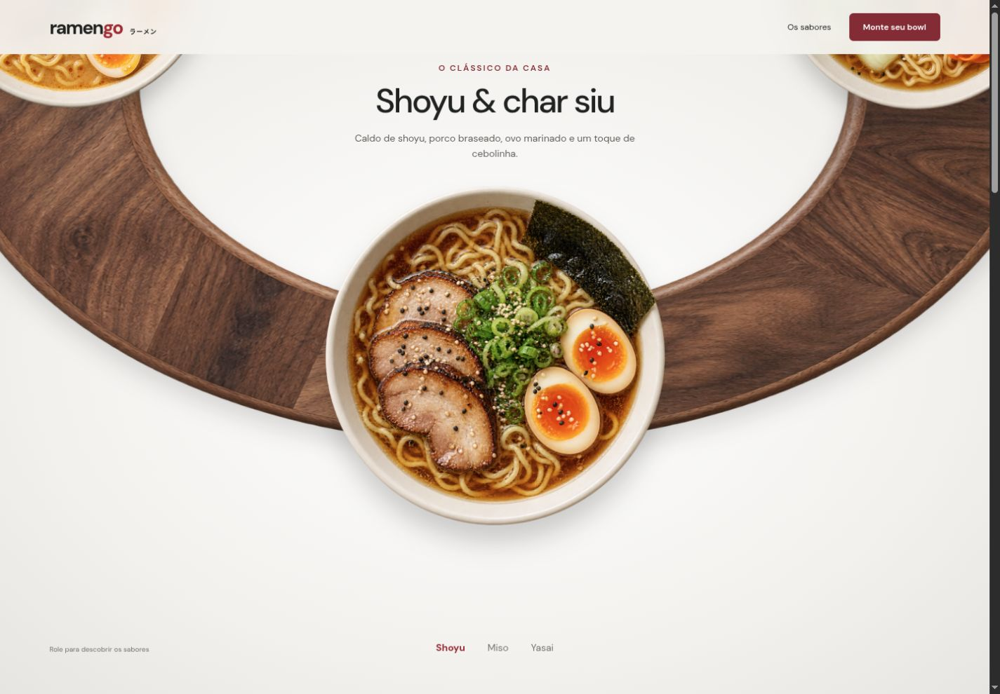
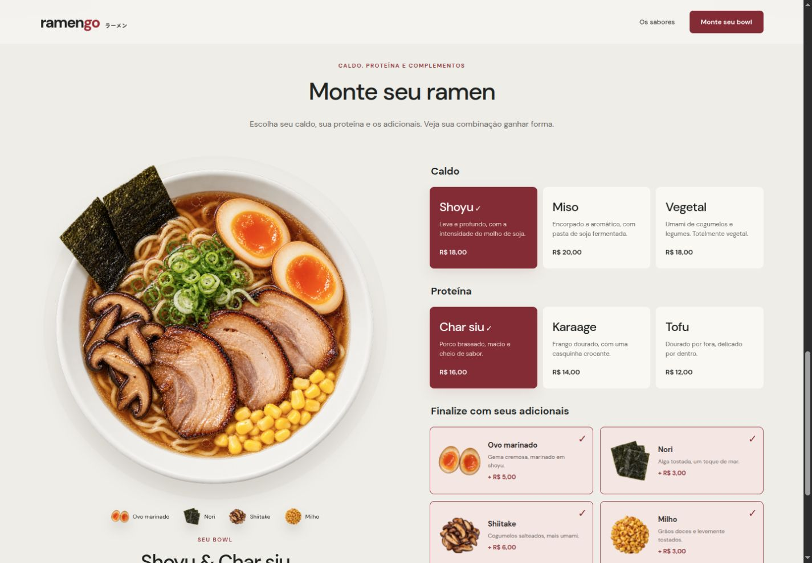

# RamenGo

Uma experiência interativa para explorar sabores e montar seu próprio ramen. Os pratos giram sobre uma composição de madeira conforme a página avança, enquanto o nome e a descrição acompanham o sabor em destaque.

[Acessar o RamenGo](https://ramengo-lamen.netlify.app/) · [Código do projeto](https://github.com/GisellyPereira/RamenGo)



## Monte seu ramen

Escolha entre três caldos, três proteínas e quatro adicionais. O montador apresenta uma fotografia específica para cada seleção, com os ingredientes escolhidos dentro do bowl e o preço atualizado em tempo real.



- **144 variações visuais:** 9 combinações de caldo e proteína × 16 seleções de adicionais.
- **Caldos:** Shoyu, Miso e Vegetal.
- **Proteínas:** Char siu, Karaage e Tofu.
- **Adicionais:** ovo marinado, nori, shiitake e milho.
- Resumo da combinação em uma janela acessível, com opção de voltar e ajustar os ingredientes.
- Navegação fixa, layout responsivo e respeito à preferência por movimento reduzido.

O cardápio e os valores são demonstrativos. A aplicação não realiza compras, pagamentos ou entregas.

## Tecnologias

JavaScript, HTML, CSS e Webpack. A animação utiliza `requestAnimationFrame`; o cardápio funciona localmente, sem depender de uma API externa.

## Executar localmente

Requer Node.js 20 ou superior.

```sh
npm ci
npm start
```

Abra [http://localhost:3014](http://localhost:3014).

## Verificar e gerar o build

```sh
npm run lint
npm test
npm run build
```

Os testes verificam os preços, as seleções parciais e os arquivos das 144 fotografias. O build, incluindo as imagens, fica em `dist/` e pode ser servido por uma hospedagem estática.

## Publicação no Netlify

O arquivo `netlify.toml` configura o build com `npm run build` e a publicação da pasta `dist`. Em um deploy manual, execute o build e envie o conteúdo de `dist`, incluindo `public/` e o arquivo `bundle.*.js`.

A pasta raiz contém o template de desenvolvimento; publicar apenas seu `index.html` deixa a página sem os estilos e as interações gerados pelo Webpack.

## Organização

- `js/script.js`: vitrine animada, seleção de ingredientes e resumo.
- `js/menu.js`: cardápio, preços e correspondência entre seleção e fotografia.
- `css/style.css`: composição e estilos responsivos.
- `public/food/`: fotografias dos pratos, variações e adicionais.
- `tests/menu.test.js`: verificação das combinações.

## Imagens

As capturas acima mostram a interface real do projeto. As fotografias dos bowls e a madeira foram geradas com imagegen. Os prompts e arquivos estão registrados em [imagens da vitrine](docs/image-prompts.md), [combinações e adicionais](docs/combination-prompts.md) e [variações dos pratos](docs/variant-prompts.md).
