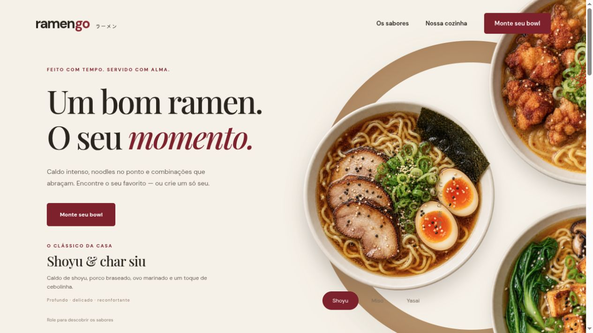

# RamenGo

Uma experiência de ramen que começa pelos sabores e termina com uma combinação feita por você. A vitrine apresenta três bowls em uma composição circular: ao rolar a página, os pratos giram e o sabor em destaque muda junto com sua descrição. Os controles também permitem escolher diretamente entre Shoyu, Miso e Yasai.



## A experiência

- Três fotografias originais de bowls, com transparência, integradas à roda animada.
- Movimento acompanhado pela rolagem, com interpolação suave e controles por teclado.
- Montador com caldo, proteína e complementos; preço calculado a cada seleção.
- Resumo acessível em dialog, com retorno à combinação.
- Layout adaptado para celular e desktop; respeito à preferência por movimento reduzido.

O cardápio e os valores são demonstrativos. A aplicação não realiza compras, pagamentos ou entregas. A prévia do bowl representa o estilo da proteína escolhida; não é uma renderização individual de cada complemento.

## Desenvolvimento

JavaScript, HTML, CSS e Webpack. Requer Node.js 20 ou superior.

```sh
npm ci
npm start
```

A prévia abre em `http://localhost:3014`.

```sh
npm run lint
npm test
npm run build
```

O build completo, incluindo as imagens, fica em `dist/` e pode ser servido por qualquer hospedagem estática. Os testes verificam os totais das combinações e seleções parciais.

## Organização

`js/script.js` controla a vitrine e o montador. `js/menu.js` reúne os ingredientes e o cálculo de preços. `css/style.css` define o layout responsivo. `public/food/` contém as fotos usadas na experiência. Os módulos e ilustrações da versão anterior permanecem no histórico e nos arquivos legados; a experiência atual utiliza um cardápio local e não depende da antiga API externa.

As imagens foram geradas com a ferramenta imagegen; os prompts e arquivos estão documentados em [docs/image-prompts.md](docs/image-prompts.md).
